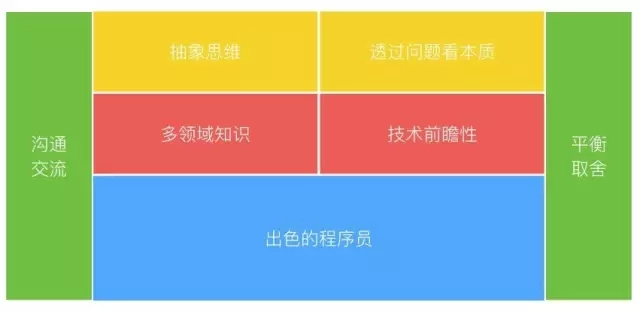

# 1.frout-end-route
座右铭：

我们必须经常自省：我们得到了什么？我们又创造了什么？

## 学习公众号

腾讯AlloyTeam
印记中文
奇舞周刊
前端大全
前端外刊评论
前端早读课
前端之巅
凹凸实验室
Node地下铁
FEX
W3cplus
w3ctech

## 学习博客

https://ts.xcatliu.com/advanced/further-reading.html

技术胖：https://jspang.com/detailed?id=58

## 书籍

https://addyosmani.com/resources/essentialjsdesignpatterns/book/

## 文档工具

https://www.gitbook.com/

## 官网

- [ts](https://www.tslang.cn/)

- [奇舞周刊](https://weekly.75.team/)

## github

https://github.com/f2e-journey/treasure

https://github.com/qianguyihao/Web

https://github.com/frontend-rescue/keep-up-to-date

## 知识查漏

1. 前端工具

>特别注意：

[vscode快捷键](https://github.com/qianguyihao/Web/blob/master/00-%E5%89%8D%E7%AB%AF%E5%B7%A5%E5%85%B7/01-VS%20Code%E7%9A%84%E4%BD%BF%E7%94%A8.md)

[GitHub使用wiki](https://juejin.cn/post/6844903529711140871)

[vscode提速](https://github.com/qianguyihao/Web/blob/master/00-%E5%89%8D%E7%AB%AF%E5%B7%A5%E5%85%B7/05-VS%20Code%E7%9A%84%E4%BD%BF%E7%94%A8%E7%A7%AF%E7%B4%AF.md)

Emmet in vscode

icoMoon字体图标 [icomoon](https://icomoon.io/app/#/select)

网络抓包和代理工具 [whistle](https://wproxy.org/whistle/)

2. HTML

3. CSS

>特别注意：

flex布局

sass入门

4. JavaScript

5. ES6

6. 异步编程

7. JS进阶

8. CSS和DOM

9. 移动WEB

10. Node.js和数据库

11. Vue

12. React

13. 性能优化

14. 面试

15. 前端工程化

16. 前端综合

17. 推荐链接

## 方向
架构师、3d、全栈、全端（有Native、微信、游戏、Node.js、Electron）、性能优化、提效、提升体验、新技术、分享和开源

- 技术主管职责

    - 技术职责

        代码规范制定和推广

        生产力工具研发和推广

        最佳实践总结和推广

        工作量评估

        任务分解、分配

        代码审核

        风险识别

        研发任务管理

        技术能力提升

        关键代码实现

    - 组织职责

        协调沟通

        招聘面试

        教练指导

        复盘总结

- 架构师

    - 技术职责

        继承技术主管的职责

        高纬度的系统设计、抽象和封装

        产品技术蓝图绘制与关键技术决策

    - 组织职责

    继承技术主管的职责

    跨技术和非技术团队的接口协作

架构师

>1. 但实际情况是大部分刚刚冠以架构师之名的优秀程序员，其能力模型大部分停留在上图中的蓝色区域，而对其他区域并未有过系统性的认识和训练。

>2. 除了技术主管的技术职责之外，架构师还需要站在更高的纬度去做关于软件系统的抽象和封装。如果技术主管的抽象和封装层次更多考虑的是语言函数、设计模式、代码结构等这一类的事务，那么架构师是站在整体软件系统高度，考虑不同子系统之间的交互关系、技术的合理性、需求的完整性、未来的演进可能性，技术体系发展与组织、产品商业诉求的匹配度。

## 职业建议
一、不要别人点什么，就做什么

二、推销自己

三、学会带领团队

四、生活才是最重要的

五、自己找到道路

六、把自己当成主人

七、找到水平更高的人

三观之一：产品观: 掌握产品常识（common sense）或者惯例（convention）

## 十步学习法

了解全局

确定范围

定义目标

寻找资源

创建学习计划

筛选资源

开始学习, 浅尝辄止

动手操作, 边玩边学

全面掌握, 学以致用

乐为人师, 融会贯通

## 学习网站和收费课程

https://ke.qq.com/teacher/1357186713

